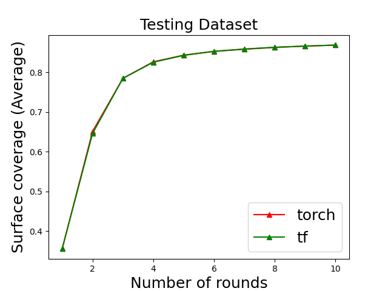

# PC-NBV: A Point Cloud Based Deep Network for Efficient Next Best View Planning

### Introduction 
This is re-implementation of PC-NBV in pytorch. Official TensorFlow implementation: [pcnbv_tf](https://github.com/Smile2020/PC-NBV)

### Environment
* Python 3.6.10
* PyTorch 1.2.0
* CUDA 10.1
* Follow [this](http://www.open3d.org/docs/release/getting_started.html) guide to install Open3D for point cloud I/O.

### Installation
1. Clone the repository:
   ```shell
   git clone xxxx
   ```
2. Data Preparation
   Please follow the official repo [pcnbv_tf](https://github.com/Smile2020/PC-NBV) to generate NBV data.
3. Train
   ```shell
   python train.py
   ```
4. Evaluate the model:
   ```shell
   python Manager.py
   python cal_cov_shapenet.py
   python drawAUC_compare_shapenet.py
   ```
   If you want to show AUC results for each class, please run:
   ```shell
   python cal_AUC.py
   ```

### Result
Class | tensorflow | pytorch
------|------------|-----
Airplane | 0.798 | 0.799
Cabinet | 0.609 | 0.612
Car | 0.614 | 0.612
Chair | 0.784 | 0.782
Lamp | 0.802 | 0.800
Sofa | 0.642 | 0.640
Table | 0.763 | 0.760
Vessel | 0.721 | 0.719
Bus | 0.672 | 0.677
Bed | 0.662 | 0.662
BookShelf | 0.738 | 0.740
Bench | 0.847 | 0.845
Guitar | 0.844 | 0.849
Motorbike | 0.730 | 0.728
Skateboard | 0.844 | 0.840
Pistol | 0.670 | 0.672
Average | 0.734 | 0.733



